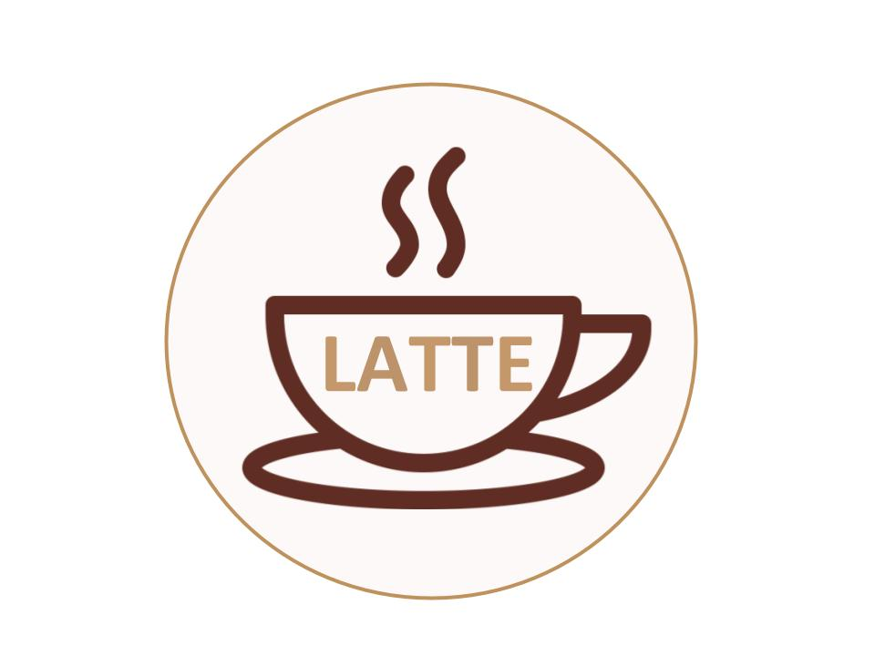
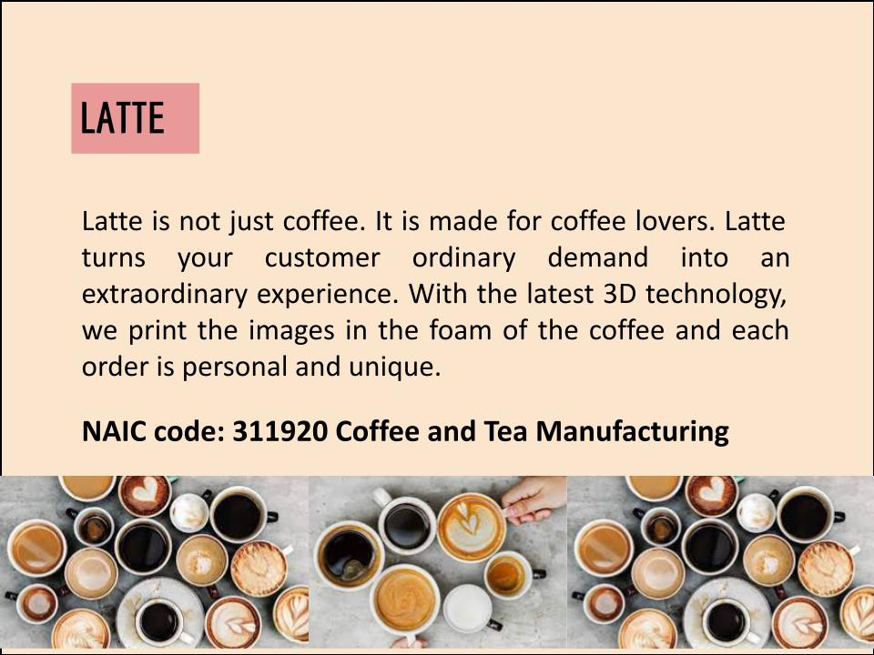
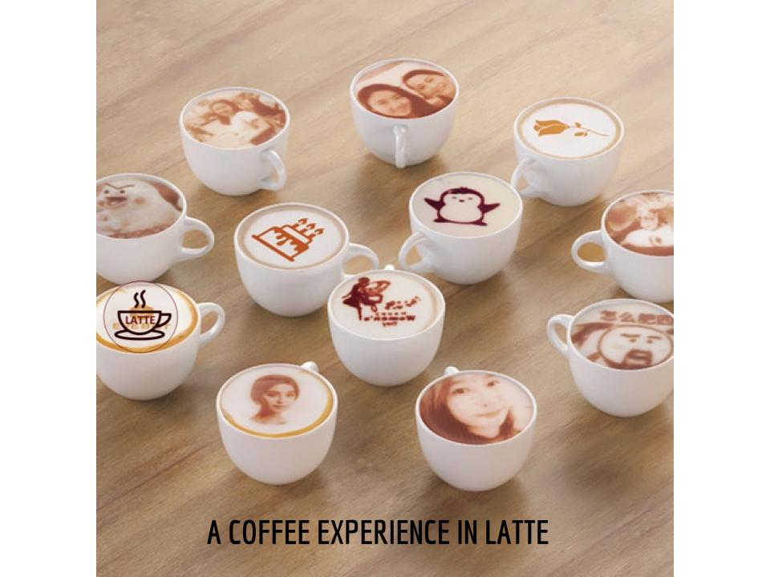
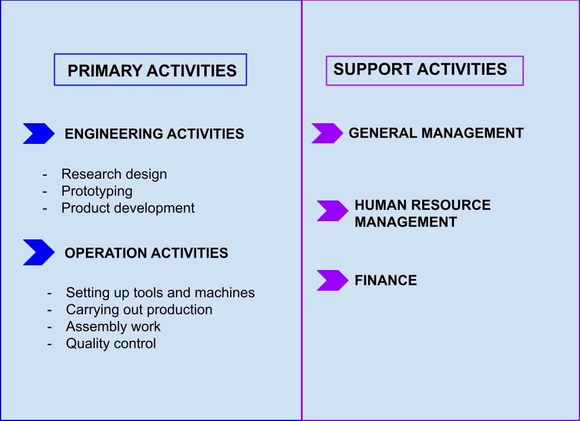
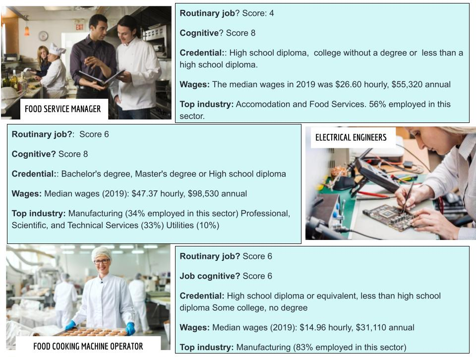
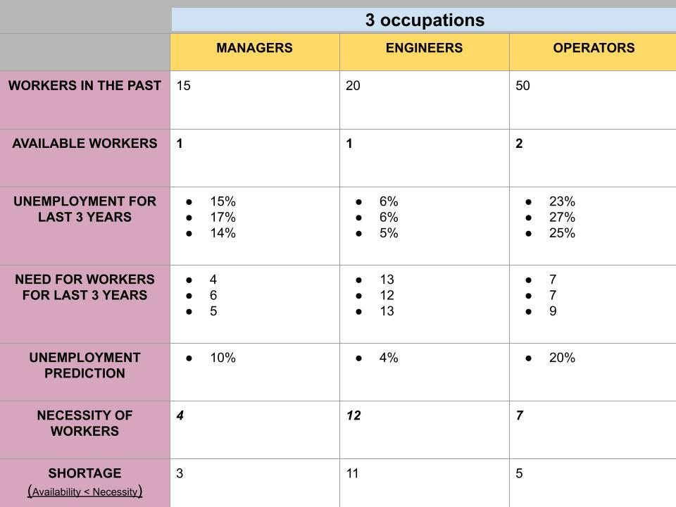
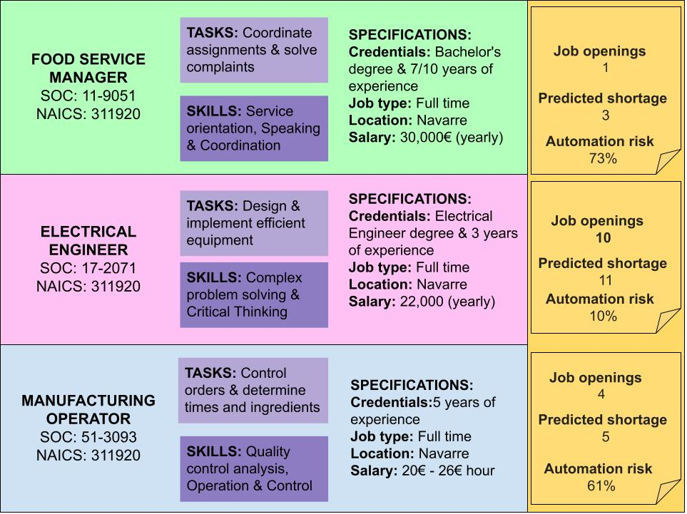

## LATTE  

***



### PRODUCTION PROCESS






INSTRUCTIONS: 
(url) and 
PARA SUBIR FOTOS:     and 
![Alt Text] (https://www.luxuryretail.es/12127-2/)


### Latte is not just coffee. It is made for coffee lovers. Latte turns your customer oordinary demand into an extraordinary experience. With the lastest 3D technology, we print the images in the foam of the coffe and each order is personal and unique. 
# NAIC code: 311920 Coffee and Tea Manufacturing
```

For more details see [GitHub Flavored Markdown](https://guides.github.com/features/mastering-markdown/).

### Jekyll Themes

Your Pages site will use the layout and styles from the Jekyll theme you have selected in your [repository settings](https://github.com/Ainhoa-Urtasun-UPNA/hohr-project-group-assignment-latte/settings/pages). The name of this theme is saved in the Jekyll `_config.yml` configuration file.

### Support or Contact

Having trouble with Pages? Check out our [documentation](https://docs.github.com/categories/github-pages-basics/) or [contact support](https://support.github.com/contact) and we’ll help you sort it out.
